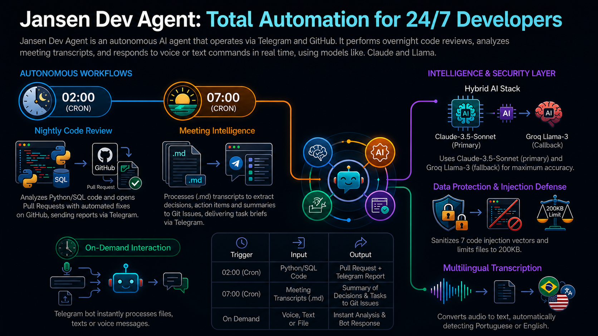
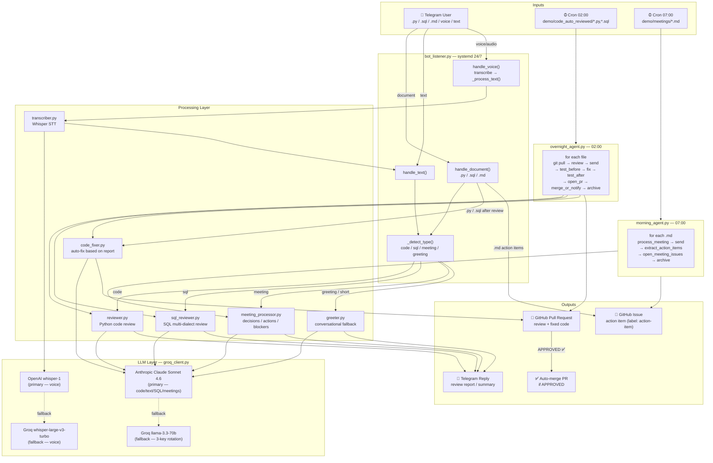

<div align="center">

# jansen_dev_agent

**Infográfico:**



</div>

An autonomous developer agent that runs 24/7 — reviewing code overnight, processing meeting notes at dawn, and responding on demand via Telegram.

<!-- SCREENSHOT: add demo screenshot here -->

---

## What it does

Three entry points. One pipeline. No human in the loop.

| Trigger | Input | Output |
|---------|-------|--------|
| **02:00 nightly** | Python/SQL files in `code_auto_reviewed/` | Telegram report + security tests before/after + GitHub PR with LLM fixes |
| **07:00 daily** | Meeting transcripts in `meetings/` | Telegram summary: decisions, action items, blockers |
| **On demand** | File, text, or voice note sent to `@jansen_dev_agent_bot` | Instant review or analysis in reply |
| **`/report` command** | Live GitHub API data | PDF metrics dashboard delivered via Telegram |

---

## Architecture



---

## Safety layer

Every file and message passes through `file_processor.py` before reaching the LLM:

- **Hard reject** — files over 200 KB never enter the pipeline
- **Smart condensation** — large files are summarized structurally (AST for Python, statement-split for SQL, heading-split for Markdown), no blind truncation
- **7-vector injection sanitizer** — neutralizes plaintext, ROT13, Base64, hex `\xNN`, unicode `\uNNNN`, URL `%NN`, and HTML `&#NNN;` injection attempts
- **XML isolation** — content wrapped in `<label>` tags with explicit decode-ignore directive

---

## Capabilities

### Python code review
Sends a `.py` file or pastes a snippet → security and quality review with severity levels:

```
🔍 order_mock_2.py — 14:32
🔴 3C  🟡 2W  🔵 1I

🔴 L7:  Path traversal → sanitize filename with os.path.basename()
🔴 L13: pickle.load() — arbitrary code execution → use json.loads()
🔴 L17: os.system() command injection → use subprocess.run() with list args
🟡 L20: no path sanitization on listdir → validate against allowed base dir
🟡 L23: no existence check before os.remove() → add Path.exists() guard

NEEDS FIXES ❌
_@jansen_dev_agent_bot_
```

For `.py` file uploads, the bot also opens a GitHub PR with the fixed code.

### SQL review
Multi-dialect — PostgreSQL, MySQL, SQLite, BigQuery, Spark SQL, T-SQL, ANSI SQL. For `.sql` file uploads, the bot also opens a GitHub PR with the fixed query:

```
🗄️ q_test_1.sql — dialect: PostgreSQL — 14:35
🔴 2C  🟡 3W  🔵 1I

🔴 L4:  GRANT ALL PRIVILEGES — overprivileged role → grant only required permissions
🔴 L7:  UPDATE without WHERE — affects all rows → add WHERE clause
🟡 L10: hardcoded credentials in INSERT → use environment variable or secrets manager
...

NEEDS FIXES ❌
```

### Meeting analysis
Send a transcript or `.md` file → structured intelligence report:

```
📋 ata-sprint-planning.md — 2026-04-28

✅ Decisions
• API gateway selected: Kong
• Auth: OAuth2 with refresh tokens

🎯 Actions
• Ana → implement rate limiting — 2026-05-05
• Bruno → write ADR for auth approach — 2026-05-03

🚫 Blockers
• DB migration script not reviewed yet

❓ Open
• Which regions for Phase 2 rollout?

⚠️ Signals
• Two engineers flagged scope as too broad for the sprint
```

### Voice and audio messages
Send a voice note or audio file → transcribed by OpenAI Whisper (Groq fallback) and routed automatically:

- Language is auto-detected (Portuguese, English, or any Whisper-supported language)
- Transcribed text shown first so you can verify what was understood
- Then routed through the same `_detect_type()` pipeline as text messages
- Audio longer than 60 seconds is trimmed with `ffmpeg` before transcription

### Language-aware greeter
Send any text that isn't code, SQL, or meeting content → the bot responds in your language:

- Greetings and "what can you do?" → intro in the detected language
- Off-topic requests → polite redirect, still in your language

---

## Tech stack

| Component | Technology |
|-----------|------------|
| LLM | Anthropic — `claude-sonnet-4-6` (primary); Groq — `llama-3.3-70b-versatile` (fallback) |
| Speech-to-text | OpenAI — `whisper-1` (primary); Groq — `whisper-large-v3-turbo` (fallback, auto-detect language) |
| Bot framework | `python-telegram-bot` 22.x (async, long-polling) |
| Scheduling | launchd (macOS) / systemd + cron (Linux) |
| GitHub integration | REST API via `requests` — branch, commit, PR, auto-merge |
| Metrics chart | Plotly + kaleido 0.2.1 — static PNG embedded in HTML |
| PDF rendering | Playwright headless Chromium — HTML → PDF |
| Audio trimming | `ffmpeg` — trims audio > 60s before transcription |
| Security tests | `pytest` — 10 tests, runs before/after every automated fix |
| Runtime | Python 3.9+ |

---

## Project structure

```
jansen_dev_agent/
├── bot_listener.py       # async Telegram bot
├── overnight_agent.py    # nightly code review agent
├── morning_agent.py      # daily meeting processor
├── reviewer.py           # Python review → Anthropic Claude (Groq fallback)
├── sql_reviewer.py       # SQL review → Anthropic Claude (Groq fallback)
├── meeting_processor.py  # meeting analysis → Anthropic Claude (Groq fallback)
├── code_fixer.py         # LLM code fix → Anthropic Claude (Groq fallback)
├── github_pr.py          # GitHub PR creation
├── greeter.py            # language-aware greeting/redirect
├── metrics.py            # GitHub API metrics + Plotly chart + HTML + PDF via Playwright
├── file_processor.py     # token budget + injection defense
├── transcriber.py        # OpenAI Whisper audio transcription (Groq fallback, auto-detect language)
├── telegram_sender.py    # Telegram API wrapper (text + document)
├── requirements.txt      # all Python dependencies
└── .env.example

demo/
├── tests/
│   └── test_security.py  # 10 security regression tests (run before/after each fix)

demo/
├── order_manager.py
├── code_auto_reviewed/   # files reviewed nightly, PRs opened
├── meetings/             # drop .md files here for morning agent
│   └── processed/
└── mocks/                # 8 test files (4 Python + 4 SQL)

deploy.sh                 # one-shot VPS setup (Oracle Cloud / Ubuntu 22.04)
```

---

## Quick start

### Local (macOS)

```bash
git clone https://github.com/ToniJansen/jansen-dev-agent.git
cd jansen-dev-agent/jansen_dev_agent

pip3 install -r requirements.txt
python3 -m playwright install chromium --with-deps
# macOS: brew install ffmpeg
# Linux: sudo apt-get install -y ffmpeg

cp .env.example .env
# fill in: ANTHROPIC_API_KEY, OPENAI_API_KEY, TELEGRAM_BOT_TOKEN, TELEGRAM_CHAT_ID, GITHUB_TOKEN, GITHUB_REPO
# optional: GROQ_API_KEY (fallback), GROQ_API_KEY_2, GROQ_API_KEY_3

python3 bot_listener.py
```

### VPS (Oracle Cloud — Always Free)

```bash
ssh -i ssh-key.key ubuntu@<VM_IP>
curl -sL https://raw.githubusercontent.com/ToniJansen/jansen-dev-agent/main/deploy.sh | bash
```

The script installs dependencies, creates a systemd service for the bot, and registers cron jobs for the scheduled agents.

### Environment variables

```bash
ANTHROPIC_API_KEY=sk-ant-...           # Anthropic console (primary LLM)
ANTHROPIC_MODEL=claude-sonnet-4-6      # optional, this is the default
OPENAI_API_KEY=sk-...                  # OpenAI console (primary STT)
GROQ_API_KEY=gsk_...                   # Groq console (fallback LLM + STT)
GROQ_API_KEY_2=gsk_...                 # optional Groq fallback key #2
GROQ_API_KEY_3=gsk_...                 # optional Groq fallback key #3
GROQ_MODEL=llama-3.3-70b-versatile     # Groq fallback model
TELEGRAM_BOT_TOKEN=...                 # from @BotFather
TELEGRAM_CHAT_ID=...                   # your Telegram user ID
GITHUB_TOKEN=ghp_...                   # personal access token (repo scope)
GITHUB_REPO=owner/repo-name
CODE_TARGET_FILE=../demo/order_manager.py
MEETINGS_DIR=../demo/meetings
```

---

## Bot commands

| Command | Description |
|---------|-------------|
| `/start` | Show capabilities and usage |
| `/report` | Owner only — generate PDF metrics dashboard (Plotly chart + GitHub live data) |
| `/maintenance on\|off` | Owner only — pause/resume the bot |

---

## Testing with mock files

Eight small files with planted issues are available in `demo/mocks/` for quick Telegram bot testing:

```bash
# Send any of these as a file attachment to @jansen_dev_agent_bot
demo/mocks/order_mock.py      # SQL injection, hardcoded credentials
demo/mocks/order_mock_1.py    # JWT secret exposed, plaintext password compare
demo/mocks/order_mock_2.py    # path traversal, pickle RCE, command injection
demo/mocks/order_mock_3.py    # hardcoded payment URL, PII leaked in logs
demo/mocks/q_test_1.sql       # GRANT ALL, UPDATE without WHERE
demo/mocks/q_test_2.sql       # Cartesian join, implicit type cast
demo/mocks/q_test_3.sql       # DROP without transaction, hardcoded prod key
```

---

## License

MIT
